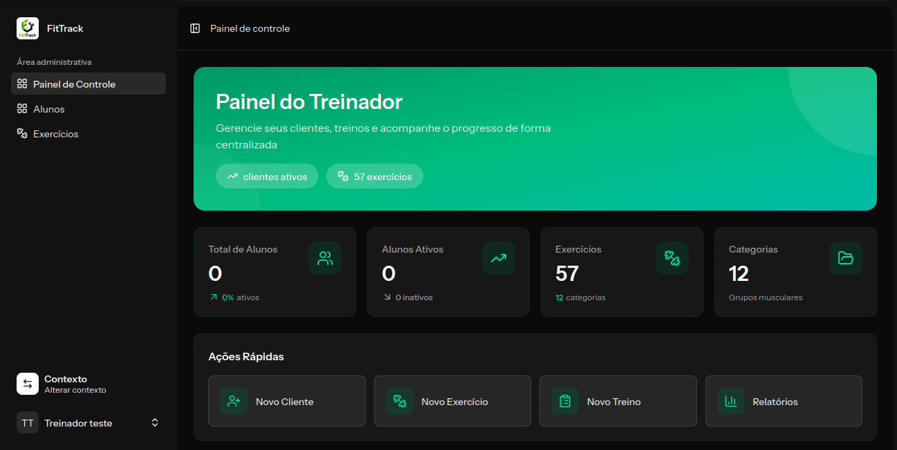

# FitTrack

> Plataforma completa de gestão fitness para personal trainers e entusiastas. Monte treinos, planeje dietas e acompanhe seu progresso — tudo em uma interface moderna.




## Visão Geral

FitTrack é uma aplicação web moderna projetada para ajudar personal trainers a gerenciar seus clientes e entusiastas fitness a acompanhar seu progresso. A plataforma calcula metabolismo basal, macronutrientes e gera dietas personalizadas e sugestões de treino com inteligência artificial.

## Funcionalidades

- **Gestão de Clientes** — Cadastro, listagem, edição e exclusão de clientes com perfil completo
- **Cálculos Inteligentes** — Cálculo automático de metabolismo basal e macronutrientes baseado nas medidas corporais
- **Treinos com IA** — Geração de planos de treino personalizados utilizando inteligência artificial
- **Controle de Acesso** — Dashboards e permissões separados para treinadores e clientes
- **Interface Moderna** — Tema escuro construído com Tailwind CSS e componentes ShadCN
- **DataTables** — Tabelas de dados reutilizáveis com ações de edição e exclusão
- **Formulários em Sheets** — Modais limpos para criação e edição de dados

## Tecnologias

| Categoria | Tecnologia |
|-----------|------------|
| **Backend** | Laravel 13, PHP 8.4 |
| **Frontend** | Vue 3, TypeScript, Inertia.js v3 |
| **Banco de Dados** | MySQL / PostgreSQL |
| **UI** | Tailwind CSS v4, ShadCN Vue |
| **Autenticação** | Laravel Fortify |
| **Testes** | Pest v4 |

## Estrutura do Projeto

```
app/
├── Actions/              # Lógica de negócio (Store, Update, Destroy)
── Http/Controllers/     # Controllers enxutos organizados por módulo
├── Http/Resources/       # Transformação de dados via Resources
├── Models/               # Models Eloquent
└── Contexts/             # Ações específicas por domínio

resources/js/
── pages/                # Páginas Inertia.js + Vue 3
├── components/           # Componentes reutilizáveis (DataTable, Sheet, Buttons)
└── layouts/              # Componentes de layout
```

## Instalação

1. Clone o repositório:
   ```bash
   git clone https://github.com/theohenrique222/fittrack-inertia.git
   cd fittrack
   ```

2. Instale as dependências do backend:
   ```bash
   composer install
   ```

3. Configure o ambiente:
   ```bash
   cp .env.example .env
   php artisan key:generate
   ```

4. Execute as migrações:
   ```bash
   php artisan migrate
   ```

5. Instale as dependências do frontend:
   ```bash
   npm install
   ```

6. Inicie o servidor de desenvolvimento:
   ```bash
   composer run dev
   ```

7. Crie uma conta de super admin:
   ```bash
   php artisan app:create-super-admin
   ```

8. Acesse a aplicação em `http://localhost:8000`

## Padrões de Desenvolvimento

- **Padrão de Actions** — Lógica de negócio isolada em classes Action dedicadas
- **Controllers Enxutos** — Controllers delegam para Actions, mantendo-se mínimos
- **Clean Code** — Nomenclatura clara, separação de responsabilidades e tipagem
- **Inertia.js** — Comunicação fluida entre backend e frontend sem APIs REST
- **Vue 3 Composition API** — Componentes reativos com `<script setup>` e TypeScript

## Autor

**Theo Henrique**

- 📧 theodoro222@hotmail.com
- 💼 [linkedin.com/in/theohenrique](https://linkedin.com/in/theohenrique)
